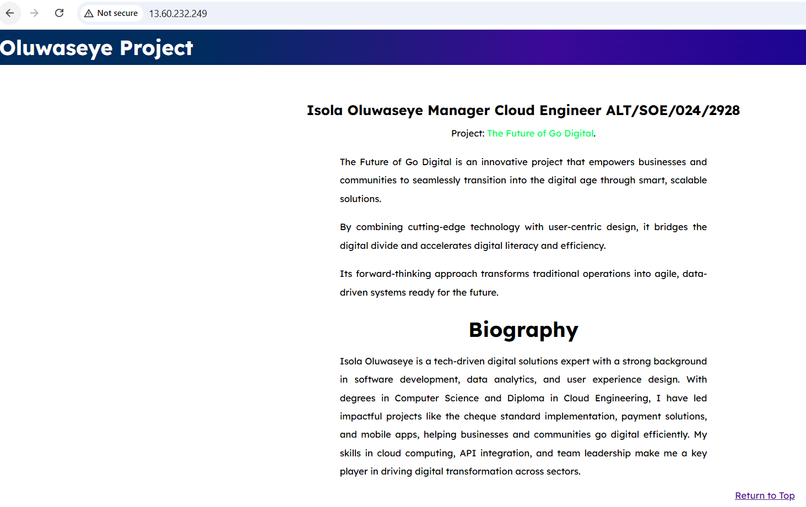

## AltSchool Second Semester Project Submission

## Server setup
 I created an account on AWS. I set up an EC2 instance by using the search bar to search for EC2 and clicking on Launch Instance. Then follow the steps below:

- Select a free tier Ubuntu image as the AMI (Amazon Machine Image).
- Select the Instance type next, I used free tier eligible t3.micro.
- Create security key pair for secure connection to your instance (ensure to pick your .pem file very safe).
- Ensure you create a security group to allow SSH connection to your instance using your .pem file.
- You can use default settings to configure instance details.
- I Created a security group under Network & security to allow HTTP (Port 80) and HTTPS (Port 443).
- I then link the instance created with the security group created.
- Launch Instance and make sure the instance state is on running.

Connect to AWS EC2 Instance using code below (for SSH Client):

ssh -i "seyti-key-altsch.pem" ubuntu@ec2-13-60-232-249.eu-north-1.compute.amazonaws.com

## STEP 2 - INSTALL NGINX & UPDATE PACKAGE
Run the command below to install nginx (option -y is to automatically say yes to the permission requested during installation)

sudo apt install nginx -y

- Run the command below to update the list of packages in package manager.

sudo apt update

- After installing the nginx service, you use the command below to start the nginx service.

sudo systemctl start nginx

- Check the status of your nginx status to ensure it is active with below

sudo systemctl status nginx
 

## STEP 3 - YOUR HTML FILE DEPLOYMENT

- First, we will navigate to the var directory which is the root path for your HTML files.

cd /var/www/html

- Then clone the git hub where your website is into the server with the command below.

 sudo git clone https://github.com/isola-seye/ExamProject.git

- Then Copy the content in the folder (ExamProject) into the root folder (/var/www/html) using the command below:

sudo cp -r * ../

Now that your index.html file is clone into the server, you can view this via the public IP of your server as seen in the screenshot below. (Ensure you set up your Security Group to allow traffic on port 80 so the website can be accessed on the internet via the public IP.)

